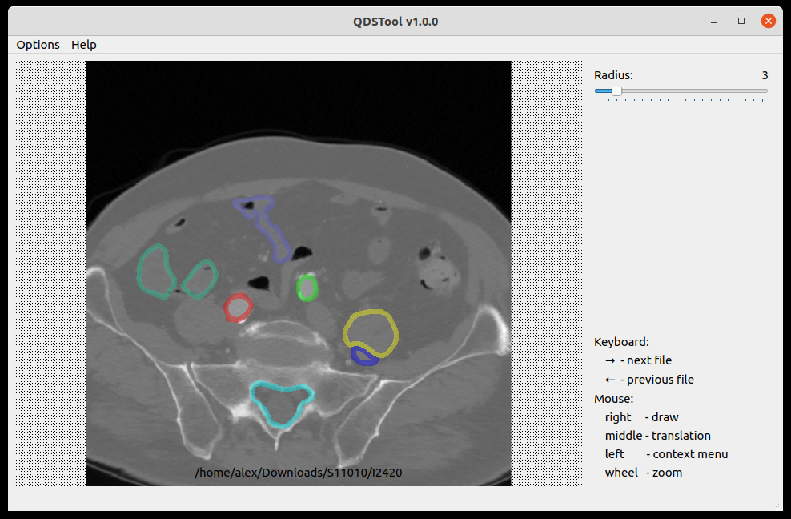

# QDSTool

As simple as possible app for manual dicom images markup. It takes on input a folder with dicom slices and returns hotmaps for each slice in png format as output.



## How to Build (for developers)

Install building tools at first. And then, following libraries are needed:

1) install or build qt5-default abd qmake

2) install or build [opencv](https://opencv.org/)

3) install or build [dcmtk-3.6.6](https://github.com/DCMTK/dcmtk) (with DCMTK_DEFAULT_DICT=builtin)

## How to install (for end users)

### Linux

You only need to have installed qt5-default:

```bash
sudo apt install qt5-default -y
```

## Run

```bash
cd QDSTool && \
export LD_LIBRARY_PATH=${LD_LIBRARY_PATH}:${PWD} && \
./QDSTool
```  

### Windows

Just run SETUP file and follow the instructions

---
Alex A. Taranov for OVISION


